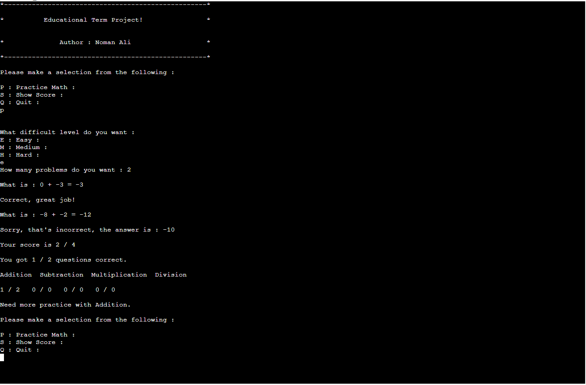

# Math Calculation Project in C++

This is project that build with C++. You can improve your math calculation by this project. there are three levels in this project easy medium and hard. 

## Authors

- [@nomankhokhar](https://www.github.com/nomankhokhar)

## Badges

## 🚀 About Me
I'm a full stack developer...

